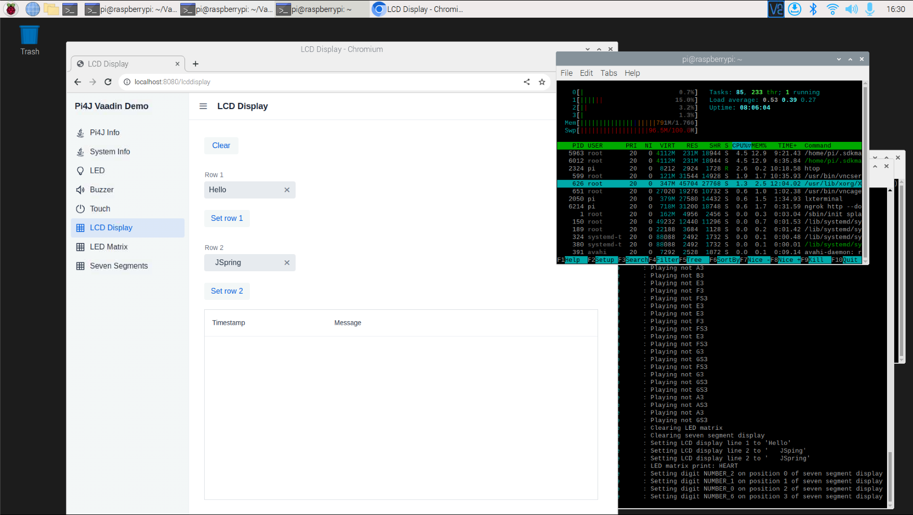
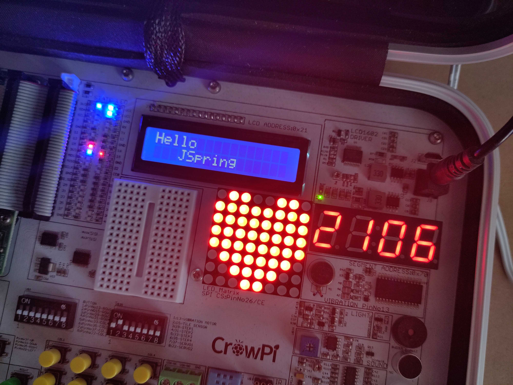

# Pi4J Demo

This is a Spring-based demo project to show how a Vaadin User Interface (website) can interact with the GPIOs of a
Raspberry Pi by using the [Pi4J library](https://www.pi4j.com).

## Supported Development Boards

The application supports multiple development boards with automatic feature detection:

### CrowPi (1, 2, and 3)
The [CrowPi](https://www.elecrow.com/mcu/raspberry-pi/development-kit.html) is an all-in-one Raspberry Pi learning kit
with various components. Different CrowPi versions contain different components, so the application adapts based on the
configured version.

**Features:** LED, Touch sensor, LCD display, 7-segment display, Buzzer, LED matrix (Red or RGB depending on version), DHT11 sensor

### Pioneer600
The Pioneer600 is a Raspberry Pi expansion board with a different set of components.

**Features:** LED (GPIO 26), Key/Button (GPIO 20), OLED display (SSD1306 via SPI), BMP280 barometric sensor (I2C), Joystick and Buzzer (PCF8574 I/O expander), IR Receiver (GPIO 18)

## Configuration

The board type is configured in `application.properties` or via command line:

```properties
# Options: crowpi-1, crowpi-2, crowpi-3, pioneer600
board.type=crowpi-2
```

You can also use any other Raspberry Pi with a GPIO header and connect electronic components directly to the GPIO pins.
Change the pin numbers as needed in a custom configuration class.

## Branch Information

Following versions of this code are available in branches:

* [main](https://github.com/FDelporte/Vaadin-examples/tree/main):
    * Dependencies got upgraded to latest versions in September 2025 of Spring Boot, Vaadin
    * Many code changes to be compatible with those new versions.
    * Uses Pi4J V4.0.0-SNAPSHOT.
    * Uses Pi4J Drivers V0.0.1-SNAPSHOT.
    * Separate services per type of device to make it easier to understand and reuse in other applications.
* [vaadin-23-spring-2.6](https://github.com/FDelporte/Vaadin-examples/tree/vaadin-23-spring-2.6): Initial example with
  LED output and button input, based on Vaadin 23 and Spring Boot 2.6. It is described in detail
  in [this Foojay.io blog post](https://foojay.io/today/blink-a-led-on-raspberry-pi-with-vaadin/).
* [vaadin-24-spring-3.0](https://github.com/FDelporte/Vaadin-examples/tree/vaadin-24-spring-3.0): Example used during a
  few conference talks,
  e.g. [Controlling Electronics with Java and Pi4J through a web interface (J-Spring 2023)](https://www.youtube.com/watch?v=FXKsBKKB_Xg)
  and [Unlocking the Potential of Bits and Bytes (Devoxx 2023)](https://www.youtube.com/watch?v=ex0t2uaL27I).

## Vaadin UI

The base code with different Vaadin layouts, was generated on [start.vaadin.com/app](https://start.vaadin.com/app).



## Components

The application can interact with various components in the CrowPi1.



## Upload to Raspberry Pi

If you are developing on a PC, you can build the application with the following command

* Windows: `mvnw clean package`
* Mac & Linux: `./mvnw clean package`

and upload to your Raspberry Pi with (replace login `pi` and the IP address with the one of your board)

```shell
$ scp target/pi4jdemo-1.0-SNAPSHOT.jar pi@192.168.0.222://home/pi/
```

Build and upload in one command:

```shell
./mvnw clean package && scp target/pi4jdemo-1.0-SNAPSHOT.jar frank@crowpi3.local://home/frank/
```

## Run on Raspberry Pi

PWM and DHT11 need to be enabled on the Raspberry Pi. For example, on a Raspberry Pi 5:

```shell
$ sudo nano /boot/firmware/config.txt
# Add at the end of the file:
dtoverlay=pwm-2chan,pin=18,func=2,pin2=12,func2=4
dtoverlay=dht11,gpiopin=4
```

We can now start the application on your Raspberry Pi to interact with the GPIOs. Specify the board type you are using:

```shell
# For CrowPi
$ java -jar /home/pi/pi4jdemo-1.0-SNAPSHOT.jar --board.type=crowpi-3

# For Pioneer600
$ java -jar /home/pi/pi4jdemo-1.0-SNAPSHOT.jar --board.type=pioneer600
```
