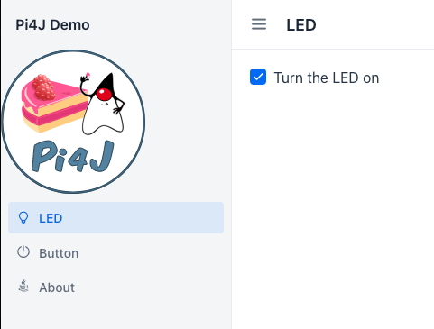

# Pi4J Demo

This is a Spring-based demo project to show how a Vaadin User Interface (website) can interact with the GPIOs of a
Raspberry Pi by using the [Pi4J library](https://www.pi4j.com).

Following versions of this code are available in branches:

* [vaadin-23-spring-2.6](https://github.com/FDelporte/Vaadin-examples/tree/vaadin-23-spring-2.6): Initial example with
  LED output and button input, based on Vaadin 23 and Spring Boot 2.6. It is described in detail
  in [this Foojay.io blog post](https://foojay.io/today/blink-a-led-on-raspberry-pi-with-vaadin/).
* [main](https://github.com/FDelporte/Vaadin-examples/tree/main): WORK IN PROGRESS ... Extended example with Vaadin
  24.0.4, Spring Boot
  3.0.6, and Pi4J 2.3.0. Blog post is "under construction".

## Vaadin UI

The base code with different Vaadin layouts, was generated on [start.vaadin.com/app](https://start.vaadin.com/app).



## GPIO interfaces

### Minimal LED and button

The GPIO interaction of the initial example is based on
the [Pi4J minimal example application](https://pi4j.com/getting-started/minimal-example-application/)
and uses a button and a LED to demonstration digital input and output interaction. The wiring is very simple and only
needs a few components


### Extended device examples

TODO

## Upload to Raspberry Pi

If you are developing on a PC, you can build the application with the following command

* Windows: `mvnw clean package -Pproduction`
* Mac & Linux: `./mvnw clean package -Pproduction`

and upload to your Raspberry Pi with (replace login `pi` and the IP address with the one of your board)

```shell
$ scp target/pi4jdemo-1.0-SNAPSHOT.jar pi@192.168.0.222://home/pi/
```

## Run on Raspberry Pi

We can now start the application on our Raspberry Pi, but need to run with `sudo` as Pi4J (still) needs this to be able
to interact with the GPIOs using PiGpio as the native library.

```shell
$ sudo java -jar /home/pi/pi4jdemo-1.0-SNAPSHOT.jar
```

If you installed Java with SDKMAN as a normal user, you will probably get this error

```
sudo: java: command not found
```

One way to fix this, is let the command itself lookup where Java is installed by using `which java`:

```shell
$ sudo `which java` -jar /home/pi/pi4jdemo-1.0-SNAPSHOT.jar
```

# Documentation generated by Vaadin start website

This project can be used as a starting point to create your own Vaadin application with Spring Boot. It contains all the
necessary configuration and some placeholder files to get you started.

## Running the application

The project is a standard Maven project. To run it from the command line, type `mvnw` (Windows), or `./mvnw` (Mac &
Linux), then open
http://localhost:8080 in your browser.

You can also import the project to your IDE of choice as you would with any Maven project. Read more
on [how to import Vaadin projects to different IDEs](https://vaadin.com/docs/latest/flow/guide/step-by-step/importing) (
Eclipse, IntelliJ IDEA, NetBeans, and VS Code).

## Deploying to Production

To create a production build, call `mvnw clean package -Pproduction` (Windows), or `./mvnw clean package -Pproduction` (
Mac & Linux). This will build a JAR file with all the dependencies and front-end resources, ready to be deployed. The
file can be found in the `target` folder after the build completes.

Once the JAR file is built, you can run it using
`java -jar target/pi4jdemo-1.0-SNAPSHOT.jar`

## Project structure

- `MainLayout.java` in `src/main/java` contains the navigation setup (i.e., the side/top bar and the main menu). This
  setup uses
  [App Layout](https://vaadin.com/components/vaadin-app-layout).
- `views` package in `src/main/java` contains the server-side Java views of your application.
- `views` folder in `frontend/` contains the client-side JavaScript views of your application.
- `themes` folder in `frontend/` contains the custom CSS styles.

## Useful links

- Read the documentation at [vaadin.com/docs](https://vaadin.com/docs).
- Follow the tutorials at [vaadin.com/tutorials](https://vaadin.com/tutorials).
- Watch training videos and get certified at [vaadin.com/learn/training](https://vaadin.com/learn/training).
- Create new projects at [start.vaadin.com](https://start.vaadin.com/).
- Search UI components and their usage examples at [vaadin.com/components](https://vaadin.com/components).
- View use case applications that demonstrate Vaadin capabilities
  at [vaadin.com/examples-and-demos](https://vaadin.com/examples-and-demos).
- Discover Vaadin's set of CSS utility classes that enable building any UI without custom CSS in
  the [docs](https://vaadin.com/docs/latest/ds/foundation/utility-classes).
- Find a collection of solutions to common use cases in [Vaadin Cookbook](https://cookbook.vaadin.com/).
- Find Add-ons at [vaadin.com/directory](https://vaadin.com/directory).
- Ask questions on [Stack Overflow](https://stackoverflow.com/questions/tagged/vaadin) or join
  our [Discord channel](https://discord.gg/MYFq5RTbBn).
- Report issues, create pull requests in [GitHub](https://github.com/vaadin/platform).
